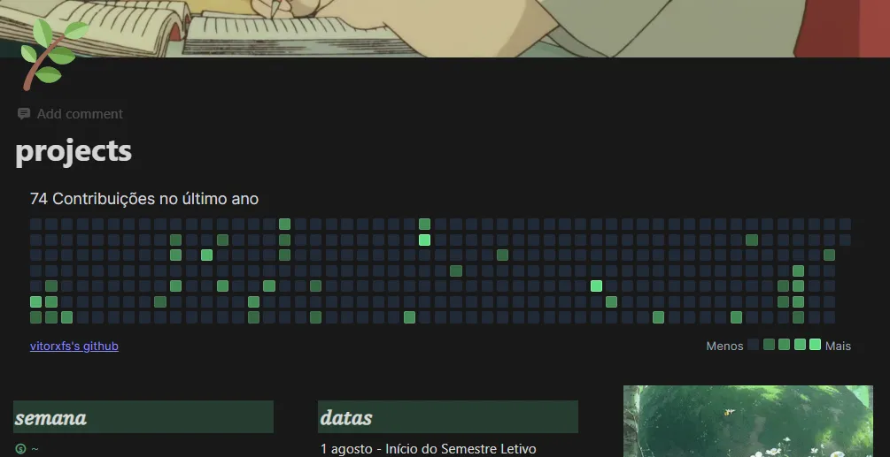
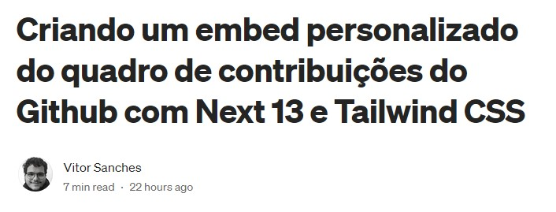

# Github Contribution Panel Embed



### This is a Github Contribution Panel embed built with [Next.js](https://nextjs.org/) and [Tailwind CSS](https://tailwindcss.com/).

### [There is a medium post](https://vitorsnx.medium.com/criando-um-embed-personalizado-do-quadro-de-contribui%C3%A7%C3%B5es-do-github-com-next-13-e-tailwind-css-5b05806d3fbe) in portuguese going through the project implementation.

[](https://vitorsnx.medium.com/criando-um-embed-personalizado-do-quadro-de-contribui%C3%A7%C3%B5es-do-github-com-next-13-e-tailwind-css-5b05806d3fbe)

## Getting Started

First, run the development server:

```bash
pnpm dev
```

Open [http://localhost:3000/contributions/\<your-username-here\>](http://localhost:3000/contributions/vitorxfs) with your browser to see the result.
